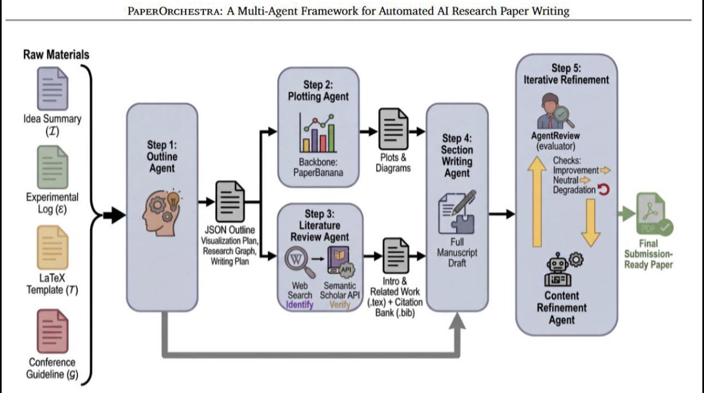

## Nguồn
- https://www.facebook.com/share/p/1EAfxNmnjB/

## Idea
AI Agent nghiên cứu và viết công bố khoa học tự động
Mình đã nhiều lần nói rằng OpenAI thì chỉ vốn quen làm product thôi chứ về nghiên cứu khoa học và opensource thì anh Gúc đang gánh cả thế giới khi mà các công ty trùm AI dường như chưa có được nền tảng nghiên cứu mạnh cho lắm it ra là so với anh Gúc và các trường đại học. Hôm nay mình lại đọc được bài trên arvix nói về một framework mới có tên Paper Orchestra. 
Mọi việc bắt đầu từ thói quen rằng viết một bài báo khoa học được xem là công việc thủ công bậc cao. Người làm nghiên cứu phải đi qua từng bước rất quen thuộc: đọc hàng chục paper, tổng hợp tài liệu, vẽ hình, viết từng section, rồi chỉnh sửa không biết bao nhiêu vòng trước khi dám submit. Nhưng với sự xuất hiện của các hệ thống multi-agent, và hôm nay mình giới thiệu PaperOrchestra, nữa thì toàn bộ quy trình này đang bắt đầu được tái định nghĩa.
PaperOrchestra không phải là một AI viết bài theo nghĩa đơn giản như các tool chỉnh sửa câu chữ. Điểm khác biệt nằm ở cấu trúc. Thay vì một model duy nhất cố gắng làm tất cả, hệ thống này được thiết kế như một dàn nhạc, nơi mỗi agent đảm nhiệm một vai trò rất cụ thể: lên outline, tìm tài liệu, tạo hình minh họa, viết từng section, và cuối cùng là phản biện và chỉnh sửa như một reviewer thực thụ. Quan trọng hơn cả là  agent này trong kiến trúc tự nói chuyện với nhau phải tự điều khiển với nhau. Chính cách orchestrate này giúp nó mô phỏng gần hơn với cách một nhóm nghiên cứu thật sự vận hành.  Nói tóm lại nó mô phỏng gần như 1 nhóm viết bài báo có người lên ý tưởng, có người chuyên làm bảng và biểu đồ có người chuyên trau chuốt câu chữ và có người review.
Nếu nhìn vào pipeline, có thể thấy đây là một quy trình rất rõ ràng và có logic. Bắt đầu từ các nguyên liệu thô như idea summary, experimental log, template hội nghị, hệ thống sẽ xây dựng một outline chi tiết, trong đó không chỉ có cấu trúc bài viết mà còn có cả chiến lược tìm tài liệu và kế hoạch vẽ hình. Sau đó, các agent chạy song song: một bên đi tìm và tổng hợp literature, một bên tạo plots và conceptual diagrams. Khi các thành phần này đã sẵn sàng, một agent khác sẽ viết toàn bộ manuscript theo format LaTeX chuẩn submission, và cuối cùng là một vòng refinement dựa trên feedback giả lập từ peer-review.  
Nhưng bài báo mà mình giới thiệu thì phần chất lượng nước lại không phải là kiến trúc mà là trang điểm đánh giá à chất lượng của phần literature review. Đây vốn là phần khó nhất với hầu hết bác sĩ và researcher mới bắt đầu, vì nó đòi hỏi vừa breadth (đọc rộng) vừa depth (phân tích sâu). Trong đánh giá human side-by-side, PaperOrchestra của  anh Guc thắng các hệ thống AI khác với margin lên tới 50–68% ở phần literature review, và 14–38% ở chất lượng tổng thể của bài báo.   Điều này cho thấy vấn đề này có vẻ như đang giành được cải thiện.
Nếu đặt vào bối cảnh thực hành, điều này có ý nghĩa rất lớn. Với một bác sĩ đang làm nghiên cứu, bottleneck không nằm ở việc không biết viết học thuật mà là không biết bắt đầu từ đâu, không biết đọc gì, và không biết kết nối các mảnh thông tin rời rạc thành một narrative khoa học. Một hệ thống như PaperOrchestra, về lý thuyết, có thể rút ngắn quá trình đó từ vài tháng xuống còn vài chục phút.
Tuy nhiên, cần một caveat rất rõ ràng. Toàn bộ framework này hiện được train và benchmark chủ yếu trên các bài báo AI, với dataset lấy từ CVPR và ICLR tức là các hội về trí tuệ nhân tạo.   Điều đó có nghĩa là khả năng tổng quát sang các lĩnh vực khác, đặc biệt là y học lâm sàng, vẫn là một dấu hỏi lớn. Cách viết, cách lập luận, và tiêu chuẩn bằng chứng trong y khoa khác rất xa so với AI. Hơn nữa thang điểm là bài báo này đưa ra lại chính là thang điểm của nhóm nghiên cứu phát triển lên. Nó không khác gì việc tự đá bóng tự thổi còi vậy
Nói tóm lại thì, PaperOrchestra là một bước tiến rất lớn về mặt cấu trúc của “AI scientist”, nhưng chưa phải là lời giải hoàn chỉnh cho mọi domain. Nếu hiểu đúng giới hạn này, đây sẽ là một công cụ cực kỳ mạnh để tăng tốc tư duy học thuật, chứ không phải để thay thế nó.

## Image
